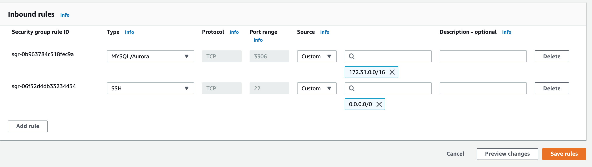
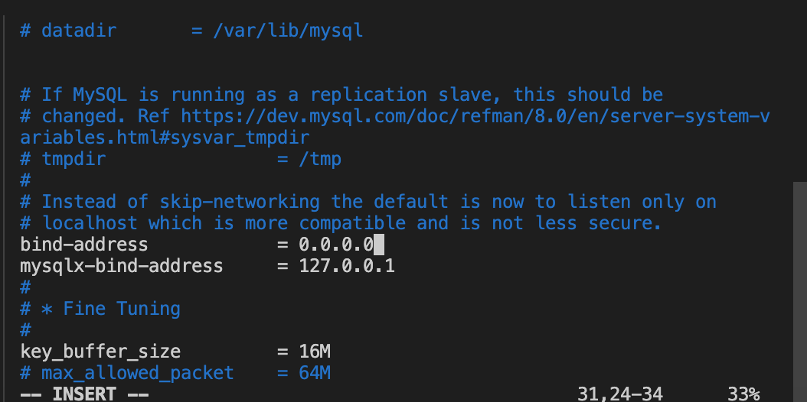
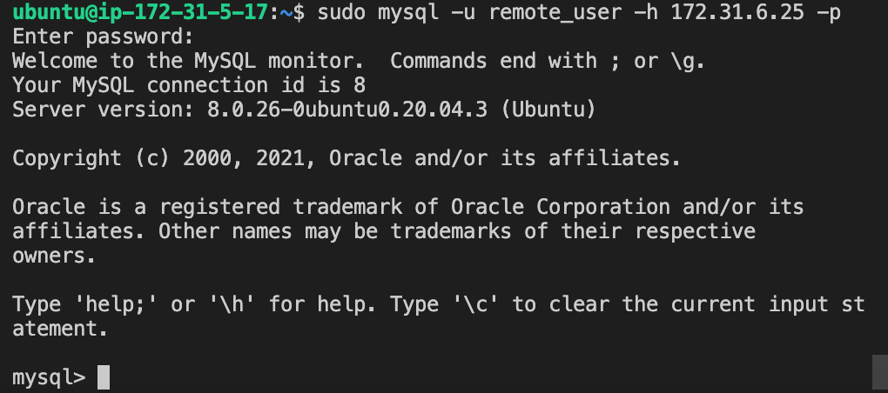
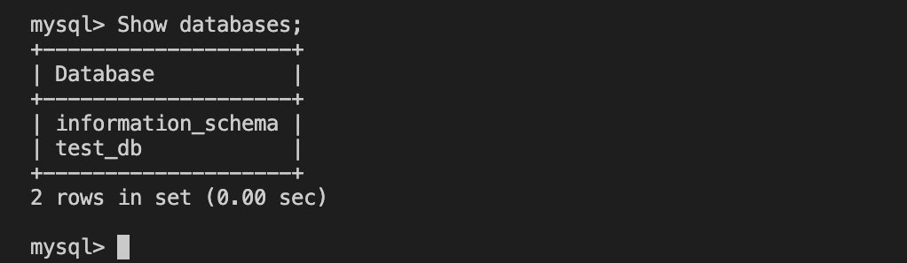

# Client Server Architecture with MySQL

*Demonstration of how to create a basic client-server architecture using MySQL Relational Database Management System.* 

*Instructions on how to launch and connect to your instance using an SSH client:*
 
https://github.com/Antonio447-cloud/MEAN-stack-angular

    Happy learning!

## Launching MySQL Servers and Running Updates

So, we will start by creating 2 Ubuntu virtual servers on AWS. One of them will be named "mysql-server" and the other one "mysql-client". 

We launch mysql-server EC2 instance and run an update:

`sudo apt update`

After that, we install MySQL software on mysql-server EC2 instance:

`sudo apt install mysql-server`

We enable MySQL service:

`sudo systemctl enable mysql`

Now, we connect to my 'mysql-client' instance and repeat the same process by running:

`sudo apt update`

`sudo apt install mysql-client`

*By default, both of virtual servers are located in the same local virtual network, so they can communicate to each other using local IP addresses. So, we will use mysql-server's instance local IP address to connect from mysql-client.*

MySQL server uses TCP port 3306 by default, so we will need to open it by creating a new entry on "Inbound Rules" on mysql-server's instance "Security Groups". For extra security, we will not allow all IP addresses to reach mysql-server. We will allow access only to the specific private IP address of mysql-client instance:

## Deploying MySQL Server

So, after configuring the Security Groups of MySQL server we deploy it and choose to validate password component for security reasons. Then we input a strong password. (Make sure you remember it)

**NOTE**: *Not validating a password component is not good for security reasons but it is ideal for development purposes only, since we are on the development process we can also choose not to validate for now.*

 Then we input 'yes' for the following:
 
 Remove anonymous users, yes. Disallow root login remotely, yes. Remove test databases and access to it, yes. Reload privileges table, yes. 

## Connecting to MySQL Server and Creating a Remote User
We connect to MySQL server:

`sudo mysql`

We create a remote user. 

**Note:** *('@'%') allows access from any IP address for the remote user:*

`CREATE USER 'remote_user'@'%' IDENTIFIED WITH mysql_native_password BY 'password-that-you-used';`

We create a database and grant privileges for the remote user for our database which we name 'test_db':

`CREATE DATABASE test_db;`

`GRANT ALL ON test_db.* TO 'remote_user'@'%' WITH GRANT OPTION;`

We enable the changes to take effect without reloading or restarting mysql service and exit MySQL:

`FLUSH PRIVILEGES;`

`exit;`

## Configuring MySQL Server to Allow Connections from Remote Hosts

We use our text editor 'vi` to go into the path: '/etc/mysql/mysql.conf.d/mysqld.cnf' and we look for 'bind-address'. Then we replace '127.0.0.1' with '0.0.0.0'.

`sudo vi /etc/mysql/mysql.conf.d/mysqld.cnf`

We restart MySQL:

`sudo systemctl restart mysql`

From "**mysql-client**" we connect remotely to "**mysql-server**" using mysql-server's private ipv4.

`sudo mysql -u remote_user -h 172.31.6.25 -p`

We check that we can run commands on my MySQL database:

